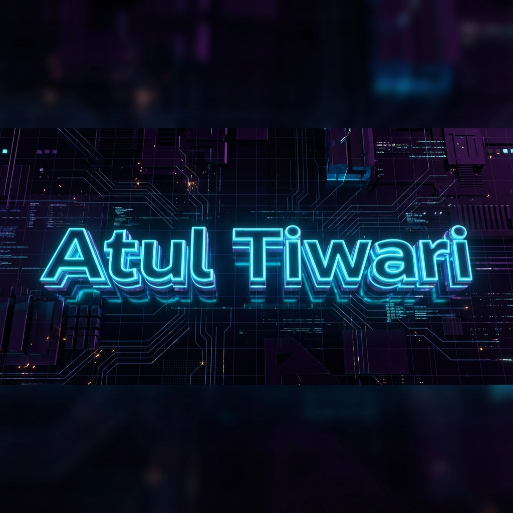

  

  

 

  <!-- 3D Trophy -->
  

  <h2>🚀 About Me</h2>
  

    I am a passionate Full Stack Developer with a knack for creating <b>immersive 3D web experiences</b>. 
    I specialize in building high-performance applications that look as good as they feel.
  

  <h2>🛠️ Tech Stack</h2>
  

    
  

 

  <h2>🏆 Experience</h2>
  <table>
    <thead>
      <tr>
        <th align="left">🏆 Role</th>
        <th align="left">🏢 Organization</th>
        <th align="left">📅 Duration</th>
      </tr>
    </thead>
    <tbody>
      <tr>
        <td><b>Full Stack Developer</b></td>
        <td>Abecsa India</td>
        <td>2024 - Present</td>
      </tr>
      <tr>
        <td><b>Web Developer</b></td>
        <td>Freelancer</td>
        <td>2023 - 2024</td>
      </tr>
    </tbody>
  </table>

 

  <h2>📊 GitHub Stats</h2>
  
  

    
    
  

   

  

   
   

  

  <h3>🤝 Connect With Me</h3>
  

    
  

